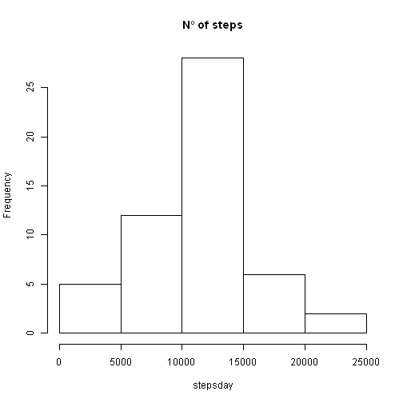
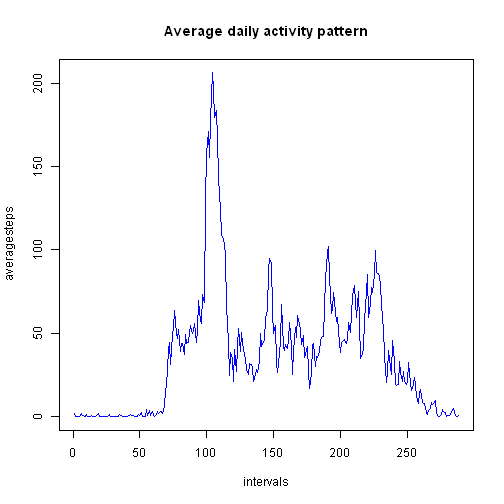
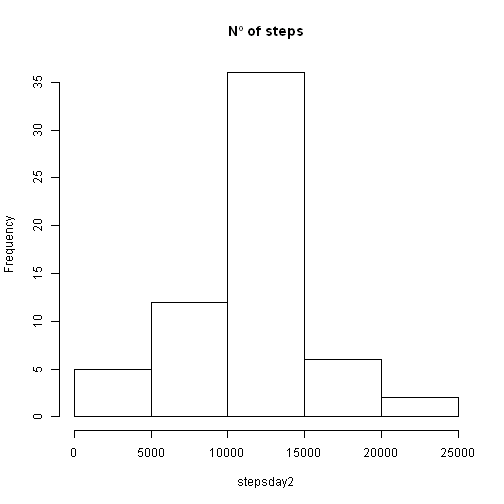
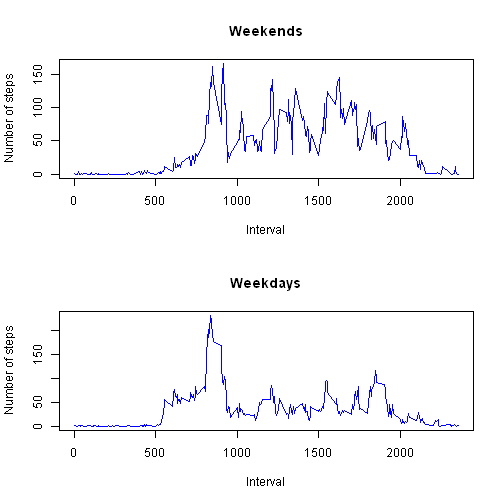

Peer Assessment 1 - Reproducible Research Course
========================================================

Loading and preprocessing the data
--------------------------------------
Load the data setting the correct directory where the file is.  
Read the .csv file

```r
setwd("~/Curso 5 Reproducible research/CP1")
data <- read.csv("activity.csv")
```


Process the data in order to remove the NA data

```r
good <- complete.cases(data)
data1 <- data[good, ]
data1$date <- factor(data1$date)
```


What is mean total number of steps taken per day?
-----------------------------------------------------

histogram of the total number of steps taken each day.

```r
stepsday <- tapply(data1$steps, data1$date, sum)
hist(stepsday, main = "Nº of steps")
```

 


Mean and median total number of steps taken per day

```r
means <- tapply(data1$steps, data1$date, mean)
medians <- tapply(data1$steps, data1$date, median)
```


* mean steps per day

```r
means
```

```
## 2012-10-02 2012-10-03 2012-10-04 2012-10-05 2012-10-06 2012-10-07 
##     0.4375    39.4167    42.0694    46.1597    53.5417    38.2465 
## 2012-10-09 2012-10-10 2012-10-11 2012-10-12 2012-10-13 2012-10-14 
##    44.4826    34.3750    35.7778    60.3542    43.1458    52.4236 
## 2012-10-15 2012-10-16 2012-10-17 2012-10-18 2012-10-19 2012-10-20 
##    35.2049    52.3750    46.7083    34.9167    41.0729    36.0938 
## 2012-10-21 2012-10-22 2012-10-23 2012-10-24 2012-10-25 2012-10-26 
##    30.6285    46.7361    30.9653    29.0104     8.6528    23.5347 
## 2012-10-27 2012-10-28 2012-10-29 2012-10-30 2012-10-31 2012-11-02 
##    35.1354    39.7847    17.4236    34.0938    53.5208    36.8056 
## 2012-11-03 2012-11-05 2012-11-06 2012-11-07 2012-11-08 2012-11-11 
##    36.7049    36.2465    28.9375    44.7326    11.1771    43.7778 
## 2012-11-12 2012-11-13 2012-11-15 2012-11-16 2012-11-17 2012-11-18 
##    37.3785    25.4722     0.1424    18.8924    49.7882    52.4653 
## 2012-11-19 2012-11-20 2012-11-21 2012-11-22 2012-11-23 2012-11-24 
##    30.6979    15.5278    44.3993    70.9271    73.5903    50.2708 
## 2012-11-25 2012-11-26 2012-11-27 2012-11-28 2012-11-29 
##    41.0903    38.7569    47.3819    35.3576    24.4688
```

* median steps per day

```r
medians
```

```
## 2012-10-02 2012-10-03 2012-10-04 2012-10-05 2012-10-06 2012-10-07 
##          0          0          0          0          0          0 
## 2012-10-09 2012-10-10 2012-10-11 2012-10-12 2012-10-13 2012-10-14 
##          0          0          0          0          0          0 
## 2012-10-15 2012-10-16 2012-10-17 2012-10-18 2012-10-19 2012-10-20 
##          0          0          0          0          0          0 
## 2012-10-21 2012-10-22 2012-10-23 2012-10-24 2012-10-25 2012-10-26 
##          0          0          0          0          0          0 
## 2012-10-27 2012-10-28 2012-10-29 2012-10-30 2012-10-31 2012-11-02 
##          0          0          0          0          0          0 
## 2012-11-03 2012-11-05 2012-11-06 2012-11-07 2012-11-08 2012-11-11 
##          0          0          0          0          0          0 
## 2012-11-12 2012-11-13 2012-11-15 2012-11-16 2012-11-17 2012-11-18 
##          0          0          0          0          0          0 
## 2012-11-19 2012-11-20 2012-11-21 2012-11-22 2012-11-23 2012-11-24 
##          0          0          0          0          0          0 
## 2012-11-25 2012-11-26 2012-11-27 2012-11-28 2012-11-29 
##          0          0          0          0          0
```


What is the average daily activity pattern?
---------------------------------------------------

```r
data1$interval <- as.factor(data1$interval)
averagesteps <- tapply(data1$steps, data1$interval, mean)
plot(c(1:288), averagesteps, type = "l", xlab = "intervals", main = "Average daily activity pattern", 
    col = "blue")
```

 


Which 5-minute interval, on average across all the days in the dataset, contains the maximum number of steps?

```r
y <- cbind(factor(data1$intervals), averagesteps)
which.max(y[, 1])
```

```
## 835 
## 104
```

* The maximum number of steps is on interval 835

Imputing missing values
------------------------------

New dataset that is equal to the original dataset but with the missing data filled in.     
* Strategy used to fill missing data: replace NA values with the mean of the 5-minute interval missed  

Replace the NA values with the average daily activity pattern obtained before to create a new dataset:

```r
data2 <- replace(data, is.na(data), averagesteps)
```


Histogram of the total number of steps taken each day

```r
stepsday2 <- tapply(data2$steps, data2$date, sum)
hist(stepsday2, main = "Nº of steps")
```

 


Mean and median total number of steps taken per day

```r
means2 <- tapply(data2$steps, data2$date, mean)
medians2 <- tapply(data2$steps, data2$date, median)
```


* mean steps per day

```r
means2
```

```
## 2012-10-01 2012-10-02 2012-10-03 2012-10-04 2012-10-05 2012-10-06 
##    37.3826     0.4375    39.4167    42.0694    46.1597    53.5417 
## 2012-10-07 2012-10-08 2012-10-09 2012-10-10 2012-10-11 2012-10-12 
##    38.2465    37.3826    44.4826    34.3750    35.7778    60.3542 
## 2012-10-13 2012-10-14 2012-10-15 2012-10-16 2012-10-17 2012-10-18 
##    43.1458    52.4236    35.2049    52.3750    46.7083    34.9167 
## 2012-10-19 2012-10-20 2012-10-21 2012-10-22 2012-10-23 2012-10-24 
##    41.0729    36.0938    30.6285    46.7361    30.9653    29.0104 
## 2012-10-25 2012-10-26 2012-10-27 2012-10-28 2012-10-29 2012-10-30 
##     8.6528    23.5347    35.1354    39.7847    17.4236    34.0938 
## 2012-10-31 2012-11-01 2012-11-02 2012-11-03 2012-11-04 2012-11-05 
##    53.5208    37.3826    36.8056    36.7049    37.3826    36.2465 
## 2012-11-06 2012-11-07 2012-11-08 2012-11-09 2012-11-10 2012-11-11 
##    28.9375    44.7326    11.1771    37.3826    37.3826    43.7778 
## 2012-11-12 2012-11-13 2012-11-14 2012-11-15 2012-11-16 2012-11-17 
##    37.3785    25.4722    37.3826     0.1424    18.8924    49.7882 
## 2012-11-18 2012-11-19 2012-11-20 2012-11-21 2012-11-22 2012-11-23 
##    52.4653    30.6979    15.5278    44.3993    70.9271    73.5903 
## 2012-11-24 2012-11-25 2012-11-26 2012-11-27 2012-11-28 2012-11-29 
##    50.2708    41.0903    38.7569    47.3819    35.3576    24.4688 
## 2012-11-30 
##    37.3826
```

* median steps per day

```r
medians2
```

```
## 2012-10-01 2012-10-02 2012-10-03 2012-10-04 2012-10-05 2012-10-06 
##      34.11       0.00       0.00       0.00       0.00       0.00 
## 2012-10-07 2012-10-08 2012-10-09 2012-10-10 2012-10-11 2012-10-12 
##       0.00      34.11       0.00       0.00       0.00       0.00 
## 2012-10-13 2012-10-14 2012-10-15 2012-10-16 2012-10-17 2012-10-18 
##       0.00       0.00       0.00       0.00       0.00       0.00 
## 2012-10-19 2012-10-20 2012-10-21 2012-10-22 2012-10-23 2012-10-24 
##       0.00       0.00       0.00       0.00       0.00       0.00 
## 2012-10-25 2012-10-26 2012-10-27 2012-10-28 2012-10-29 2012-10-30 
##       0.00       0.00       0.00       0.00       0.00       0.00 
## 2012-10-31 2012-11-01 2012-11-02 2012-11-03 2012-11-04 2012-11-05 
##       0.00      34.11       0.00       0.00      34.11       0.00 
## 2012-11-06 2012-11-07 2012-11-08 2012-11-09 2012-11-10 2012-11-11 
##       0.00       0.00       0.00      34.11      34.11       0.00 
## 2012-11-12 2012-11-13 2012-11-14 2012-11-15 2012-11-16 2012-11-17 
##       0.00       0.00      34.11       0.00       0.00       0.00 
## 2012-11-18 2012-11-19 2012-11-20 2012-11-21 2012-11-22 2012-11-23 
##       0.00       0.00       0.00       0.00       0.00       0.00 
## 2012-11-24 2012-11-25 2012-11-26 2012-11-27 2012-11-28 2012-11-29 
##       0.00       0.00       0.00       0.00       0.00       0.00 
## 2012-11-30 
##      34.11
```


Are there differences in activity patterns between weekdays and weekends?
-------------------------------------------------------------------------------
Create a new factor variable in the dataset with two levels - "weekday" and "weekend" indicating whether a given date is a weekday or weekend day.

```r
Sys.setlocale("LC_TIME", "en")
```

```
## [1] "English_United States.1252"
```

```r
weekdays <- ifelse((weekdays(as.Date(data2$date))) %in% c("Saturday", "Sunday"), 
    "weekend", "weekday")
data2$weekday <- as.factor(weekdays)
```


Panel plot containing a time series plot of the 5-minute interval (x-axis) and the average number of steps taken, averaged across all weekday days or weekend days (y-axis)

```r
averagesteps2 <- data.frame(tapply(data2$steps, list(data2$interval, data2$weekday), 
    mean))
par(mfrow = c(2, 1))
plot(row.names(averagesteps2), averagesteps2$weekend, type = "l", ylab = "Number of steps", 
    xlab = "Interval", col = "blue", main = "Weekends")
plot(row.names(averagesteps2), averagesteps2$weekday, type = "l", ylab = "Number of steps", 
    xlab = "Interval", col = "blue", main = "Weekdays")
```

 


